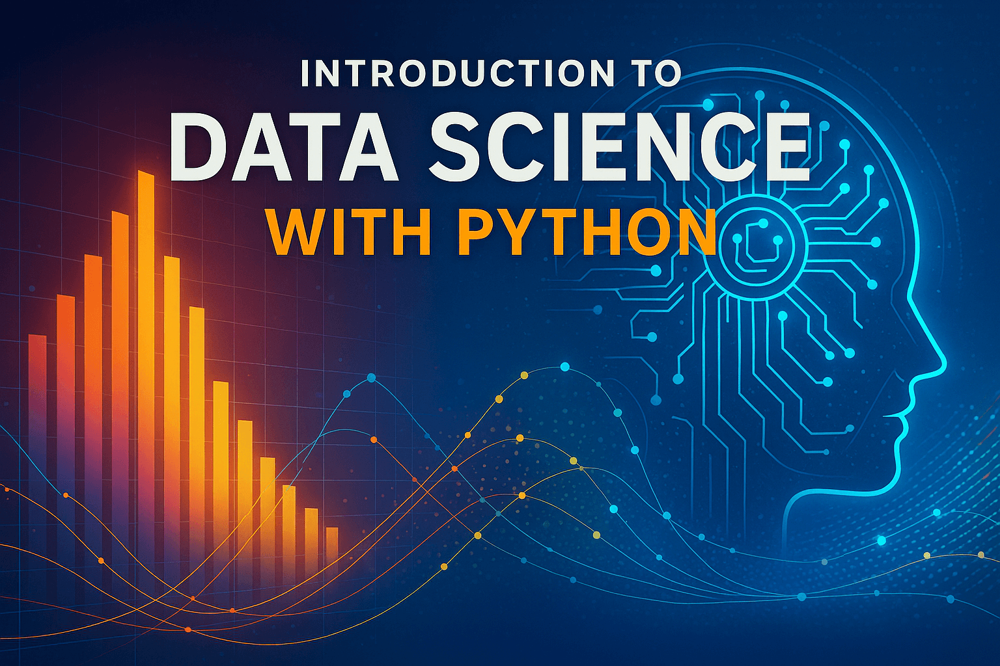

<!-- Hide the title since it is in the cover-->

Welcome to our website for the course that uses AI to
help students learn data science.  This course is designed to help
advanced high-school and freshman college students quickly learn
the core concepts of data science with extensive use of [Micro-Simulations](./glossary.md/#microsimulation)
and AI.

Please contact me on [LinkedIn](https://www.linkedin.com/in/danmccreary/) if you have any questions.

- Dan McCreary