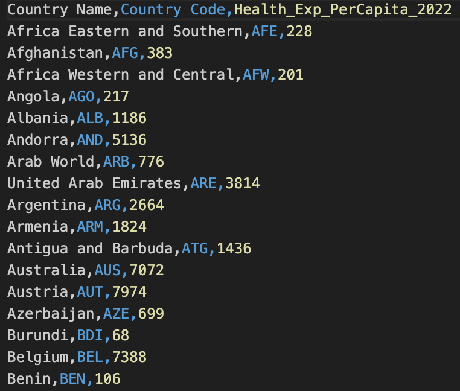

# Lab 1: Dataframes

## Steps

### Step 1: Load the following dataset using your IDE such as Visual Studio Code

https://github.com/dmccreary/data-science-course/blob/main/data/lab-01/healthcare-per-capita-2022.csv

### Step 2: Load the Rainbow CSV Extension into Visual Studio Code

