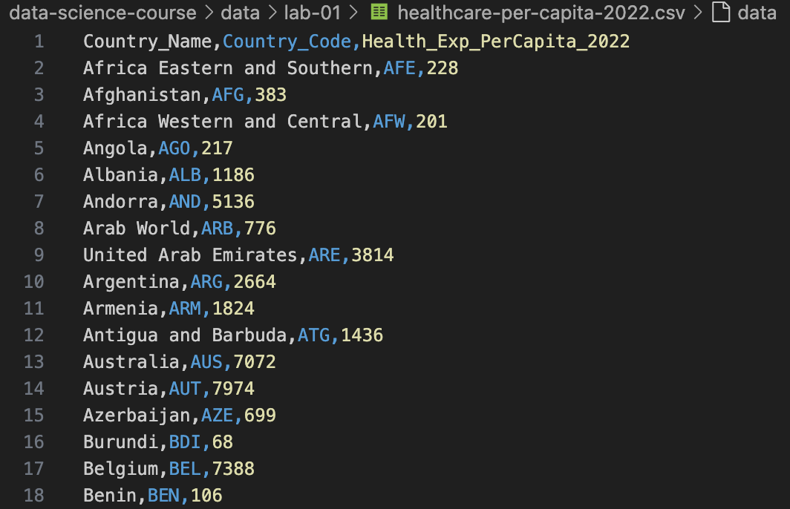

# Lab 1: Dataframes

## Steps

These steps assume you have setup your desktop using an IDE such as Visual Studio Code.
See the [Setup Chapter](../chapters/00-setup/index.md) for details.

### Step 1: Load the following dataset using your IDE such as Visual Studio Code


### Step 2: Load the Rainbow CSV Extension into Visual Studio Code



### Step 3: Load Python Code

```python
# Import the pandas library for data manipulation
import pandas as pd

# Load the CSV file into a pandas DataFrame
# This assumes the CSV file is in the same directory as this script
df = pd.read_csv('healthcare-per-capita-2022.csv')

# Count the number of rows (lines) in the DataFrame
line_count = len(df)

# Display the first few rows to verify the data loaded correctly
print("First 5 rows of the data:")
print(df.head())

# Print the total number of lines
print(f"\nTotal number of lines in the CSV file: {line_count}")

# Optional: Display basic information about the DataFrame
print(f"\nDataFrame shape (rows, columns): {df.shape}")
print(f"Column names: {list(df.columns)}")
```

If you get the following `Module Not Found` error, you must make sure that you use pip to install the pandas library.

```
import pandas as pd
ModuleNotFoundError: No module named 'pandas'
```

```sh
(ds) $ pip install pandas
```

Note that the '(ds)' in the prompt means you are working with your ds (data science) virtual Python environment.

## Step 4: Run Python Code

```sh
python count-lines.py
```

Result:

```
python count-lines.py 
First 5 rows of the data:
                  Country_Name Country_Code  Health_Exp_PerCapita_2022
0  Africa Eastern and Southern          AFE                        228
1                  Afghanistan          AFG                        383
2   Africa Western and Central          AFW                        201
3                       Angola          AGO                        217
4                      Albania          ALB                       1186

Total number of lines in the CSV file: 238

DataFrame shape (rows, columns): (238, 3)
Column names: ['Country_Name', 'Country_Code', 'Health_Exp_PerCapita_2022']
```
